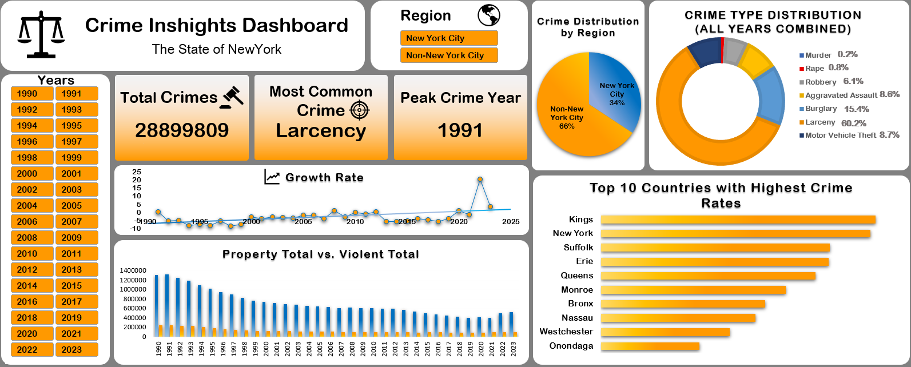

# 📊 Crime Insights Dashboard (Excel-Based Analysis)

A data-driven dashboard built entirely in **Microsoft Excel** to analyze and visualize crime trends across the **State of New York**. The dashboard presents comprehensive insights using interactive visuals, charts, and KPI indicators.

---

## 📌 Dashboard Objective

The primary objective of this project is to utilize Excel’s data visualization and analytical capabilities to understand historical crime trends, regional disparities, and category-wise breakdowns across New York from 1990 to 2023.

---

## 🧭 Key Features & Analyses

### 1. 📈 Crime Trends Over Time
- A line chart visualizes the trend of total crimes (Index Total) year by year.
- Helps identify peak and declining crime periods (e.g., peak in 1991).

### 2. 🧩 Crime Breakdown by Category
- A donut chart shows the proportion of various crime types:
  - Larcency (60.2%) is the most common.
  - Other types include Burglary, Robbery, Motor Vehicle Theft, and more.

### 3. 🏆 Top 10 Countries with Highest Crime Rates
- Horizontal bar chart ranking countries such as Kings, New York, and Suffolk based on total crime volume.

### 4. 🥊 Violent vs. Property Crimes Comparison
- A stacked column chart contrasts violent and property crimes across years.
- Highlights patterns and shifts in crime types over decades.

### 5. 🌍 Regional Crime Analysis
- Pie chart comparing **New York City vs. Non-New York City** crime shares.
- Slicers/filters enable regional-focused insights.

### 6. 🎯 KPI Cards
- Summary statistics and indicators such as:
  - **Total Crimes:** 28.9 million+
  - **Most Common Crime:** Larceny
  - **Peak Crime Year:** 1991

---

## 🗂️ Files Included

| File | Description |
|------|-------------|
| `Crime_Inshights_Dashboard.xlsx` | The interactive Excel dashboard file |
| `Crime_Dataset.csv` | Raw dataset used for dashboard development |
| `Crime_Inshights_Dashboard.png` | Static image preview of the dashboard |

---

## 💡 Tools & Skills Demonstrated

- 📌 Microsoft Excel (Charts, PivotTables, Slicers, KPI Cards)
- 📊 Data Visualization
- 🔍 Crime Data Analysis
- 📁 Data Cleaning and Structuring
- 🧠 Insight Extraction

---

## 📣 Final Notes

This project showcases how powerful Excel can be for building professional dashboards and performing in-depth analysis — even without code. It’s a great example of transforming raw data into meaningful insights using just spreadsheet tools.

Feel free to explore the files and use them as a reference or template for similar projects.

---
